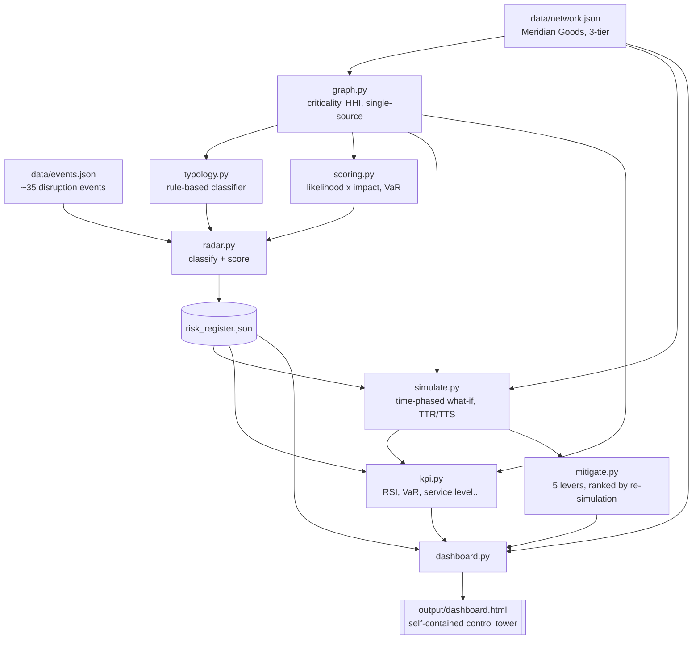
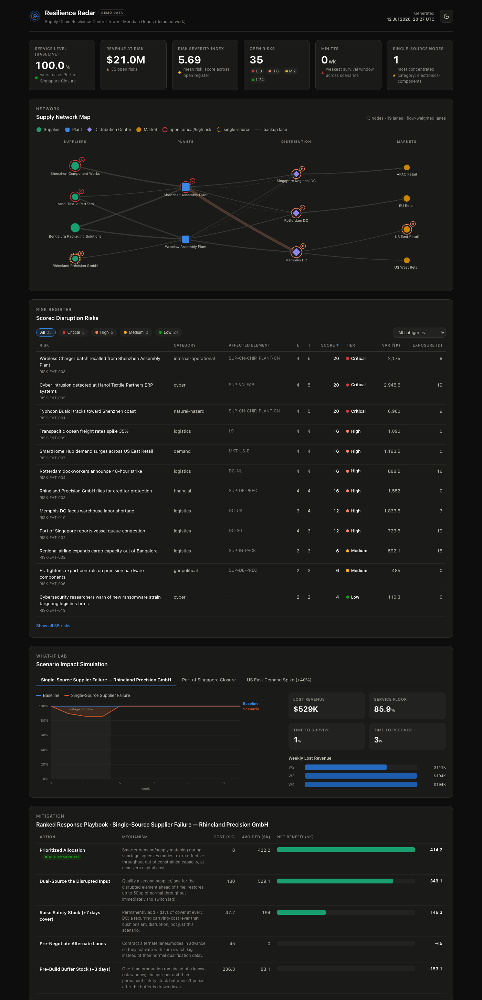

# Resilience Radar

**A supply-chain control tower: disruption feed → risk register → time-phased what-if simulation → ranked mitigations → single-file HTML dashboard. Pure Python stdlib, zero dependencies, zero API keys.**

[](https://www.python.org/)
[](#60-second-quickstart)
[](tests/)
[](LICENSE)

## Why

Every supply chain runs on a working assumption that nothing important
will break at the same time as anything else. That assumption fails
predictably — a single-source supplier, a port with no bypass, a demand
spike that outruns distribution capacity — and it usually fails in ways
that were computable in advance, not genuinely unforeseeable. Resilience
Radar is a small demonstration of that idea: given a modeled network and a
disruption feed, you can compute *which* nodes are structurally fragile,
*how long* the business survives before service degrades, and *how fast*
it recovers — all before the disruption happens, using nothing more exotic
than arithmetic over a graph and a 12-week weekly simulation loop. This
mirrors the resilience-metrics work of Sheffi, Simchi-Levi, and Ivanov
(TTR/TTS, ripple-effect propagation) and applies it to a synthetic but
structurally realistic three-tier consumer-goods network.

## Architecture



## 60-second quickstart

```bash
git clone https://github.com/LaviSahu/supply-chain-resilience.git
cd resilience-radar
make demo             # scan events, run all 3 scenarios, rank mitigations, build dashboard
open output/dashboard.html
```

No `pip install` required — the entire engine is Python 3.10+ standard
library. `make demo` is equivalent to `PYTHONPATH=src python3 -m
resilience_radar demo`.

Real console output from a live run (KPI summary excerpt):

```
Scanned -> 35 risks

ID            TIER      SCORE  L  I  CATEGORY              ELEMENT                VAR($k)  EXP(d)  HEADLINE
------------  --------  -----  -  -  --------------------  ---------------------  -------  ------  --------------------------------------------
RISK-EVT-001  CRITICAL  20     4  5  natural-hazard        SUP-CN-CHIP, PLANT-CN  6,960.0  9       Typhoon Bualoi tracks toward Shenzhen coast
RISK-EVT-005  CRITICAL  20     4  5  cyber                 SUP-VN-FAB             2,945.6  19      Cyber intrusion detected at Hanoi Textile Pa
RISK-EVT-008  CRITICAL  20     4  5  internal-operational  SUP-CN-CHIP, PLANT-CN  2,175.0  9       Wireless Charger batch recalled from Shenzhe
...

Scenario: Port of Singapore Closure [port-closure]
  outage weeks 1-2  baseline service 100.0%  worst service 79.0%
  TTS (time to survive): 0w   TTR (time to recover): 2w
  total lost revenue: $578,800

KPI summary:
KPI                       VALUE          UNIT        CONTEXT
------------------------  -------------  ----------  ------------------------------------------------------------------
Service Level (baseline)  100.00         %           worst case: Port of Singapore Closure
Revenue at Risk           20,994,914.00  $           35 open risks
Risk Severity Index       5.69           score       mean risk_score across open register
Open Risks                35.00          count       CRITICAL:3, HIGH:6, MEDIUM:2, LOW:24
Single-Source Nodes       1.00           count       most concentrated category: electronics-components

Dashboard written -> output/dashboard.html
```

Run the test suite: `make test` (67 tests, `unittest`, no dependencies).



## Feature tour

| Module | Concept | What it does |
|---|---|---|
| `typology.py` | Two-axis risk taxonomy (source × consequence), LIHF/HILF | Deterministic keyword + network-alias classifier turns event text into `(source_category, consequence_class, frequency_class, matched nodes/lanes)` |
| `scoring.py` | Likelihood × impact, value at risk | Blends event confidence with source reliability for likelihood; blends network criticality with expected outage length for impact; scores 1–25, tiers CRITICAL/HIGH/MEDIUM/LOW |
| `graph.py` | Network analytics | Revenue-based node/lane criticality, single-source detection, HHI supplier concentration, downstream market reachability, lead-time exposure gap |
| `radar.py` | Event feed → risk register | Orchestrates classify + score over `events.json`, writes a sorted JSON register |
| `simulate.py` | Deterministic time-phased what-if | 12-week weekly propagation per (DC, SKU) pair: upstream capacity bottlenecks, alt-sourcing with switch lag, inventory drain, lost sales; computes TTR/TTS |
| `mitigate.py` | Mitigation playbook | 5 levers (dual-source, safety stock, alt-lane pre-negotiation, pre-build buffer, prioritized allocation), each re-simulated and ranked by net benefit |
| `kpi.py` | KPI catalog | RSI, revenue at risk, risk density, TTR/TTS, service level, single-source count, HHI — every number computed from real engine outputs |
| `llm.py` | Optional LLM adapter | Anthropic / OpenAI classifiers with automatic offline fallback; never required, never touches simulation math |
| `dashboard.py` | Self-contained HTML | One dark-themed `dashboard.html`: KPI tiles, sortable risk register, SVG network map, scenario comparison charts, mitigation rankings — inline CSS/JS/SVG, zero CDN |
| `cli.py` | `python -m resilience_radar` | `scan` / `simulate --scenario` / `demo` / `dashboard` — hand-rolled ANSI console tables, no formatting dependency |

## KPI reference

| KPI | Definition |
|---|---|
| **RSI** (Risk Severity Index) | Mean `risk_score` across the open risk register — one number for "how hot is the register right now" |
| **VaR** (Value at Risk) | Weekly revenue through the affected element × expected outage weeks (by consequence class: deviation 0.5w, disruption 2.5w, disaster 8w) |
| **TTR** (Time to Recover) | Weeks from a scenario's first service-level dip below 98% until it returns to ≥98% |
| **TTS** (Time to Survive) | Consecutive weeks of ≥98% service the network sustains before that first dip |
| **Service Level** | `shipped_revenue / demand_revenue` for a given week; baseline should read ~100%, confirming the network is modeled in equilibrium |
| **HHI** | Herfindahl-Hirschman Index (0–10,000) of supplier concentration per input category — 10,000 = single-supplier monopoly |
| **Single-Source Count** | Number of (plant, SKU) pairs fed by exactly one supplier with zero redundancy |

Full formulas as implemented (not idealized): [docs/03-kpi-reference.md](docs/03-kpi-reference.md).

## Design decisions

- **Deterministic simulation core, LLM as an optional interface layer.**
  The entire propagation engine — capacity bottlenecks, inventory drain,
  TTR/TTS — is fixed, hand-written, unit-tested Python. An LLM, when
  enabled via `--llm`, only ever narrows down which pre-defined category a
  headline belongs to; it never generates code or touches a simulation
  number. This is a deliberate contrast with agentic code-generation
  patterns like Microsoft's **OptiGuide**, which has an LLM write and run
  code against an optimization model per query — powerful for open-ended
  exploration, but harder to reproduce, test, and trust unattended. See
  [docs/05-llm-integration.md](docs/05-llm-integration.md) for the full
  argument.
- **Zero-dependency, zero-API-key demo.** `make demo` runs end to end on a
  bare Python 3.10+ install. The offline rule-based classifier is the
  default and the only path exercised by the test suite — an `--llm` flag
  with no key present degrades gracefully rather than erroring.
- **TTR/TTS as first-class metrics**, not an afterthought bolted onto a
  cost model — every scenario reports them directly alongside lost
  revenue, in the Simchi-Levi resilience-metrics tradition.
- **Everything computed, nothing hardcoded.** The KPI catalog, the risk
  scores, the mitigation rankings — all derived from `network.json` and
  `events.json` at run time. Edit either input and every downstream
  number, in the console and the dashboard alike, changes accordingly
  (they read from the same in-memory objects — see
  [docs/01-architecture.md](docs/01-architecture.md)).

## Scenario walkthrough: Port of Singapore Closure

The `port-closure` preset fully closes the Singapore Regional DC
(`DC-SG`) for 2 weeks. It is the worst of the three preset scenarios by
service-level floor, despite having the shortest outage window:

- **Worst service level: 79.0%** (both outage weeks)
- **TTS: 0 weeks** — the very first week of the closure already breaches
  the 98% threshold; there is no buffer
- **TTR: 2 weeks** — service returns to full the week the port reopens
- **Total lost revenue: $578,800**

Why it's worse than the 4-week supplier failure: a full DC closure hits
every SKU routed through Singapore simultaneously. An air-freight bypass
lane (Shenzhen Assembly Plant → Singapore DC, 1-week switch lag) protects
SmartHome Hub and Wireless Charger, but Tote Bag, Travel Mug, and
Multi-Tool have no bypass at all and take the full hit for both weeks.

Top-ranked mitigation: **Prioritized Allocation** ($8k cost, $496.4k
avoided loss, $488.4k net benefit) — the cheapest lever in the playbook,
because it also adds physical capacity to lanes touching the disrupted
element, not just a `capacity_pct` recovery. **Dual-Source the Disrupted
Input** ranks second ($180k cost, $578.8k avoided, $398.8k net) — full
avoidance at a much higher setup cost. Full walkthrough of the propagation
mechanics and how to define your own scenario:
[docs/04-scenario-guide.md](docs/04-scenario-guide.md).

## Documentation

- [docs/index.md](docs/index.md) — wiki home
- [01 — Architecture](docs/01-architecture.md)
- [02 — Risk Typology](docs/02-risk-typology.md)
- [03 — KPI Reference](docs/03-kpi-reference.md)
- [04 — Scenario Guide](docs/04-scenario-guide.md)
- [05 — LLM Integration](docs/05-llm-integration.md)
- [06 — Roadmap](docs/06-roadmap.md)

## License

MIT — see [LICENSE](LICENSE).

---

Built by Lavi Sahu — supply chain planning practitioner.
