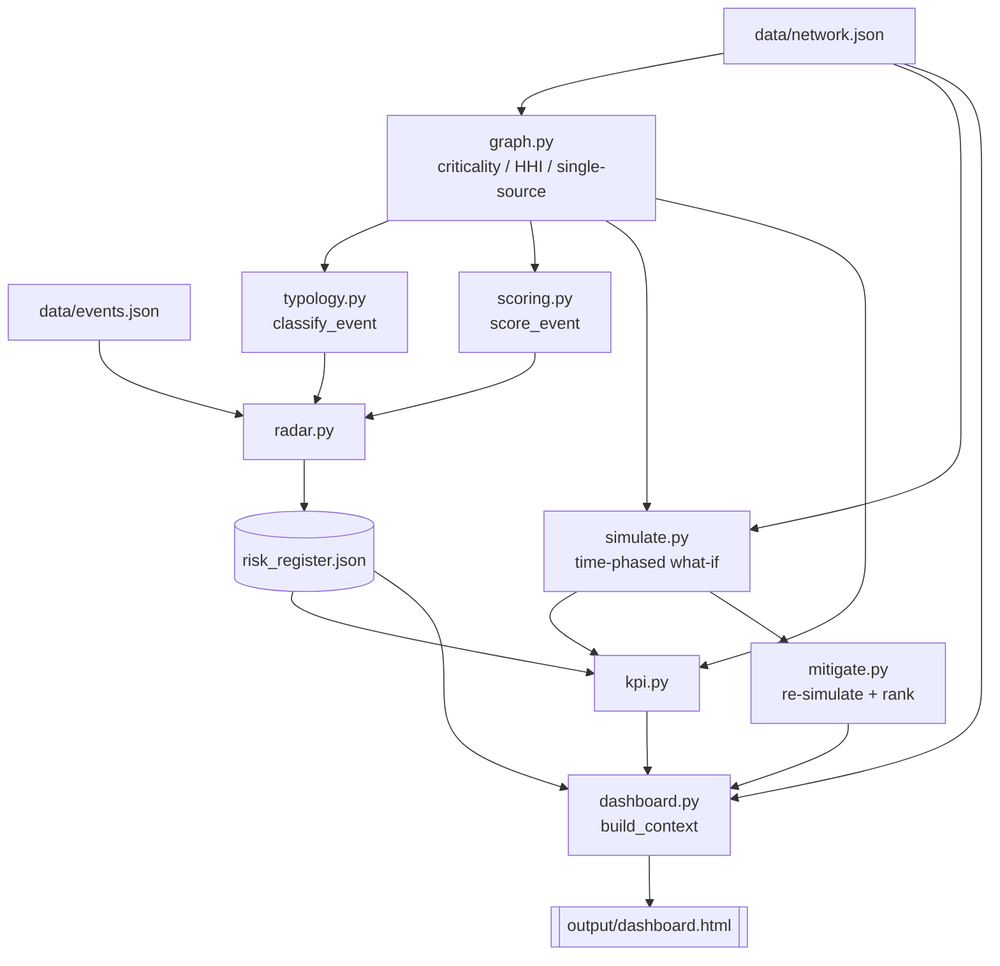

# Architecture

## Module map

```
src/resilience_radar/
├── models.py     dataclasses only: Node, Lane, Sku, Network, Event, Risk,
│                 Scenario, WeekResult, SimResult — the shared vocabulary
├── graph.py      network analytics: criticality, single-sourcing, HHI,
│                 downstream reachability, exposure-days
├── typology.py   two-axis risk taxonomy + deterministic keyword classifier
├── scoring.py    Event + Classification -> scored, tiered Risk
├── radar.py      orchestration: events.json -> risk register (JSON)
├── simulate.py   deterministic time-phased what-if engine (TTR/TTS)
├── mitigate.py   playbook of 5 levers, ranked by re-simulation
├── kpi.py        KPI catalog computed from register + sim results
├── llm.py        optional classifier adapter (Anthropic/OpenAI/offline)
├── dashboard.py  build_context() + render_dashboard() -> dashboard.html
└── cli.py        `python -m resilience_radar {scan,simulate,demo,dashboard}`
```

Every module carries a docstring that explains the *concept*, not just the
code — read the module before reading this page if you want the deeper
reasoning; this page is the map, not the territory.

## Data flow



Three independent inputs feed the pipeline:

- **`data/events.json`** — the raw disruption feed (~35 items: headline,
  body, source, region, confidence, date). Nothing else about a risk is
  known until it's classified.
- **`data/network.json`** — the synthetic "Meridian Goods" three-tier
  network: 13 nodes (suppliers, plants, DCs, markets), 19 lanes, 5 SKUs.
  This is the only place revenue, capacity, lead time, and inventory live.
- **CLI flags** (`--network`, `--events`, `--output`) — override the
  defaults; `cli._resolve()` falls back to the repo-root copy if the given
  path doesn't exist relative to the current working directory, so `demo`
  works the same whether run from the repo root or elsewhere.

## The dashboard context contract

`dashboard.build_context(network, risks, kpis, sim_results, mitigations,
generated_at)` is the single seam between "engine" and "presentation." It
returns one JSON-serializable dict with exactly these top-level keys
(enforced by `tests/test_dashboard.py`):

| key | shape |
|---|---|
| `generated_at` | ISO timestamp string |
| `company` | `network.company` |
| `kpis` | the `kpi.compute_kpis()` catalog |
| `network` | nodes (each carrying `x`, `y`, and computed `criticality`) + lanes |
| `risk_register` | the full scored, tiered risk list |
| `scenarios` | one entry per preset id, each with `baseline_weeks` / `scenario_weeks` (12 entries each — `simulate.HORIZON_WEEKS`) |
| `mitigations` | one entry per preset id, each a list matching `mitigate.PLAYBOOK` length |

Because both the CLI's console tables and `dashboard.py`'s HTML tiles read
from the *same* `kpis`/`sim_results`/`mitigations` objects (see
`cli._run_full_pipeline`), the numbers on screen and in the terminal can
never drift apart — there's no separate "dashboard math."

## Why a two-stage simulation per DC

`simulate.py` runs propagation once per `(DC, SKU)` pair rather than once
per `(market, SKU)` pair. A DC that serves more than one market (Memphis DC
serves both US East and US West) has one shared inventory pool and one
shared upstream supply chain — modeling it per-market would double-count
that pool. See [Scenario Guide](04-scenario-guide.md) for the full
propagation mechanics.

## Why the CLI has four verbs, not one

- `scan` — just the register, for someone who only wants today's risks.
- `simulate --scenario ID` — just one what-if, for testing a hypothesis.
- `demo` — the full pipeline, what a first-time reader should run.
- `dashboard` — rebuild the HTML from whatever `output/risk_register.json`
  already exists, without re-scanning (useful after hand-editing a JSON
  output to explore "what if this event scored differently").

Next: [Risk Typology](02-risk-typology.md).
